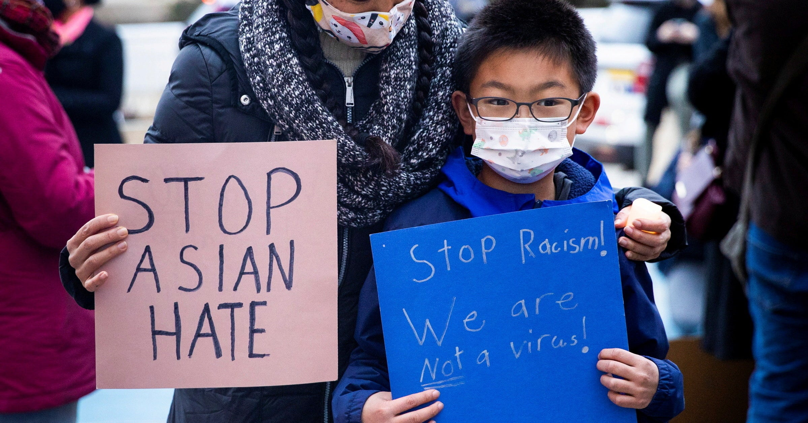

# Assignment 1: Protests
The past few years in the United States, there has been a surge in protests in support of Black Lives Matter, gender equity, and other social issues. In this assignment, you'll work with data from [CountLove](https://countlove.org/) -- the same data often [cited](https://www.nytimes.com/2020/08/28/us/black-lives-matter-protest.html) by the New York Times -- to learn more about demonstrations over the past few years.

By completing the assignment, you will demonstrate the following skills:

- Use of **version control** for managing your code
- Declaring document rendering using **markdown** syntax
- Foundational programming skills in R.

## Background Research
Before diving into this (or any) dataset, it's important to have _domain familiarity_ (i.e., to know something about the topic). As preparation, I'm asking that you read **three articles** about protests in the U.S., and provide a brief 1 - 2 sentence summary or takeaway from each one.

In the section below, create an **unordered list** of the three articles you found. Make sure to provide an appropriate markdown link (_not_ just the URL) to the article in addition to your 1 - 2 sentence summary.

- In the article "[Thousands protest violence against Asian Americans during National Day of Action protests](https://www.cbsnews.com/news/asian-american-protests-national-day-of-action-condemn-violence-against-asian-americans/)" published by CBS news, it talks about how thousands of Asian Americans rallied together across the country to protest and bring awareness to the racial discrimination that they were dealing with. The article states a fact that from March 202 to April 2021 there was an estimated 3,800 hate crimes against Asians.

- In the article "[Black Lives Matter May Be the Largest Movement in U.S. History](https://www.nytimes.com/interactive/2020/07/03/us/george-floyd-protests-crowd-size.html)" published by The New York Times, it talks about how the Black Lives Matter movement is one of the largest movements ever in America, and an estimated 15 to 26 million people in the US have participated in events associated with George Floyd at the time of the posting. There have also been more than 4,700 demonstrations or an average of 140 per day across the U.S. since the first protest in Minneapolis on May 26.

- In the article "[South Korean workers channel "Squid Game" to protest their real-life economic woes](https://www.cbsnews.com/news/south-korea-squid-game-labor-union-protest/)" published by CBS news, it talks about the people of South Korea who have used the popularity of the Netflix Show "Squid Game" to bring attention to their demands for better working conditions. The show "Squid Game" shows aspects of the economy and debt with the main character losing his job and demanding his job back which in many ways is related to what the South Koreans are demanding.

## Accompanying Image
In this section, please **display one image** to accompany your text, and describe _why_ you included it (~2 - 3 sentences). This will require that you download an image into your project folder. In your description, use **bold** and _italics_ (at least once, for practice) to emphasize some of your points.

I chose this image because during the pandemic many Asians got a lot of hate for being the reason that _COVID-19_ became a virus and many people called it the **Chinese Flu**. This is relative to this assignment because many Asians began to protest against the hate and violence against them for something that they had no control over and had nothing to do with.

## Analysis
At this point, you should open up your `analysis.R` script to begin working with the data. The script will guide you through an initial analysis of the data. Throughout the script, there are prompts labeled **Reflection**. Please write 1 - 2 sentences for each of these reflections below:

- What does the difference between the mean and the median tell you about the *distribution* of the data?

  The difference between the mean and median tells me that the mean is much larger than the median. What this means is that the data is skewed right which means that there were a few protests with a lot of attendees (outliers) which increased the mean but the median stayed low since there weren't too many protests with a high amount of attendees and the majority of protests were still low.

- Does the number of protests in Washington surprise you? Why or why not?

  The number of protests in Washington does not surprise me because Washington tends to be a pretty liberal state. What this means is liberals tend to push more for change which can be done with protests, which is why Washington had a large number of protests.

- Looking at the `state_table` variable, what data quality issues do you notice, and how would you use that to change your analysis (no need to actually change your analysis)?

  The quality issue I found in the state_table was that some people forgot to capitalize the state abbreviation which created more unique states than there actually were. What I would change in this case of the dataset is to set the minimum protests to be greater than 1 so it would remove all the states with 1 protest which are the states with the wrong capitalization.

- Does the change in the number of protests from 2019 to 2020 surprise you? Why or why not?

  The change in the number of protests from 2019 to 2020 doesn't surprise me. I am not surprised by the surge of protests because in 2020 there was a big uproar around police brutality after the tragic death of George Floyd and the major backing of the Black Lives Matter movement. This led to many protests from the Black Lives Matter community which was a big factor in the increase of protests in 2020.

- Do a bit of research. Find at least *two specific policies* that have been changed as a result of protests in 2020. These may be at the city, state, or University level. Please provide a basic summary, as well as a link to each article.

  In 2020 the Council of the District of Columbia passed an emergency police and justice reform bill which stated that officers will no longer be able to use chokeholds or neck restraints among many other restrictions for police officers it also requires additional training of officers on topics including racism and white supremacy. [District of Columbia](https://dccouncil.us/council-unanimously-passes-emergency-police-and-justice-reform-measure/)

  The Berkeley City Council passed a policy to ban tear gas permanently and stop the police’s use of pepper spray and smoke during the pandemic. This means that police officers will no longer be able to carry or use tear gas on civilians. [Berkeleyside](https://www.berkeleyside.org/2020/06/10/officials-ban-tear-gas-in-berkeley-approve-other-police-reforms)

- Take a look (`View()`) your `high_level_table` variable. What picture does this paint of the U.S.?

  The picture that is painted from the `high_level_table` is that there is a lot of _"Racial Injustice"_ in the United States since the table shows a very high amount of protests in the _"Racial Injustice"_ category compared to any other category.

## Critical Reflection
Now that you have had time to work with the data and visualize it, I want you to practice thinking critically about the dataset we provided. An important part of data analysis is reflecting on the assumptions, limitations, and gaps in your datasets. Remember that all datasets have to make assumptions and not all assumptions are bad or unreasonable! Practicing these skill will help you in your career to be self critical and ethically alert.

For this section, please write 2-3 sentences for each of the reflections below:

- How was the dataset collected and who collected the data?

  The initial protest data came from the Crowd Counting Consortium, while the majority of the data came from them crawling the local newspaper and television sites. The people that collected this data were Tommy Leung and Nathan Perkins who are engineers and scientists with a keen interest in civic responsibility and public policy.

- What assumptions does the dataset make? List at least two assumptions you identified. For inspiration, check out this [blog post](https://towardsdatascience.com/check-your-assumptions-about-your-data-20be250c143) that describes one method for identifying data assumptions.

    One assumption the dataset makes is the number of attendees at each protest, a lot of the time the creators of the dataset had to do a rough estimate or had to put NA if no information was given on the number of attendees. Another assumption made was that every protest had only one reason, there could be many protests that had more than one reason for protesting.

- What data is missing from the dataset? Think about if there are any data points you would have liked to have seen in the dataset.

   A piece of data that I think is missing from the dataset is were the protests peaceful or violent. I think this would provide a better perspective of what each protest was like and then you can use the data points to find which states had more peaceful protests and which states had more violent protests.

## Final Thoughts
When you are finished, with your analysis, please answer the following questions in 1-2 sentences each.

- What about the analysis surprised you?

  What surprised me in the analysis was that many protests had 0 attendees. This was surprising because I was confused about how there could be a protest without any attendees.

- What parts of this analysis did you find challenging?

  The hardest part of the analysis for me was finding the substring before the parentheses. I also found a couple of the instructions in the analysis were a little unclear.

- What types of analysis do you wish you were able to do with the dataset, but currently don't have the technical skills to do?

    I wish I was able to take the locations in the dataset and plot them on a map to be able to visualize the locations and show what cities have more or less protests in a visual view.
